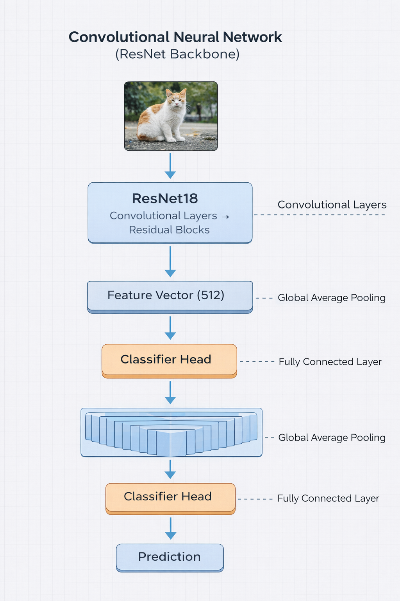
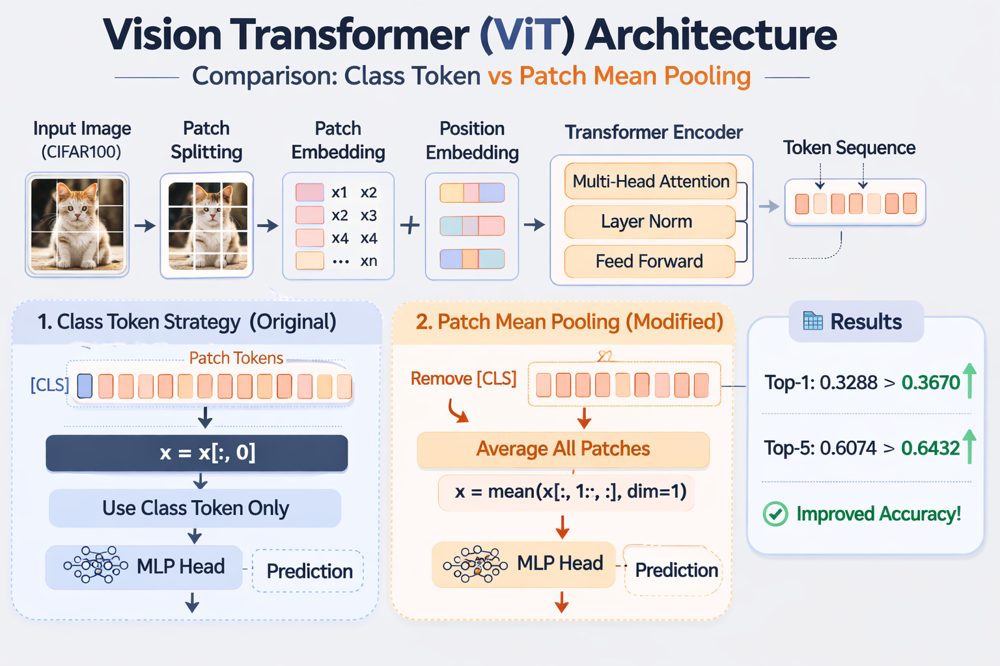

# AI Model Architecture Lab

This repository explores fundamental deep learning model architectures used in modern AI systems.

The goal of this project is to experiment with different model design choices and understand how architectural modifications affect performance.

The experiments focus on:

- Convolutional Neural Networks (CNN)
- Vision Transformers (ViT)

---

# Experiments

## 1. CNN Backbone Replacement

Experiment: Replace the CNN backbone architecture.

Original backbone:

ResNet50

Modified backbone:

ResNet18

Dataset:

Oxford-IIIT Pet Dataset

Goal:

Study how backbone size affects feature extraction and classification performance.

Experiment folder:

experiments/cnn-backbone-replacement

---

## 2. Vision Transformer Representation Strategy

Experiment: Compare two token aggregation strategies in Vision Transformers.

Original method:

Class Token Representation

Modified method:

Patch Mean Pooling

Dataset:

CIFAR100

Goal:

Investigate whether averaging all patch embeddings provides better global representation than relying on the class token.

Experiment folder:

experiments/vit-representation

---

# CNN Architecture

This architecture uses a ResNet backbone to extract visual features from images.

Pipeline:

Input Image  
↓  
ResNet18 Backbone  
↓  
Global Average Pooling  
↓  
Fully Connected Classifier  
↓  
Prediction

---

# Vision Transformer Architecture

Vision Transformers split images into patches and process them as token sequences using a Transformer encoder.

Two representation strategies are compared:

• Class Token  
• Patch Mean Pooling

---

# Repository Structure

AI-Model-Architecture-Lab  
│  
├─ assets  
│   ├─ CNN architecture with ResNet backbone.png  
│   └─ ViT architecture comparison_ pooling strategies.png  
│  
├─ experiments  
│  
│   ├─ cnn-backbone-replacement  
│   │     ├─ notebook.ipynb  
│   │     └─ README.md  
│   │  
│   └─ vit-representation  
│         ├─ notebook.ipynb  
│         └─ README.md  
│  
└─ README.md  

---

# Future Work

Future experiments may include:

- Vision Transformer attention visualization
- CNN vs Transformer performance comparison
- Lightweight transformer architectures
- Hybrid CNN–Transformer models

---

# Author

Po-Yun Chen  
AI × Semiconductor Engineer
